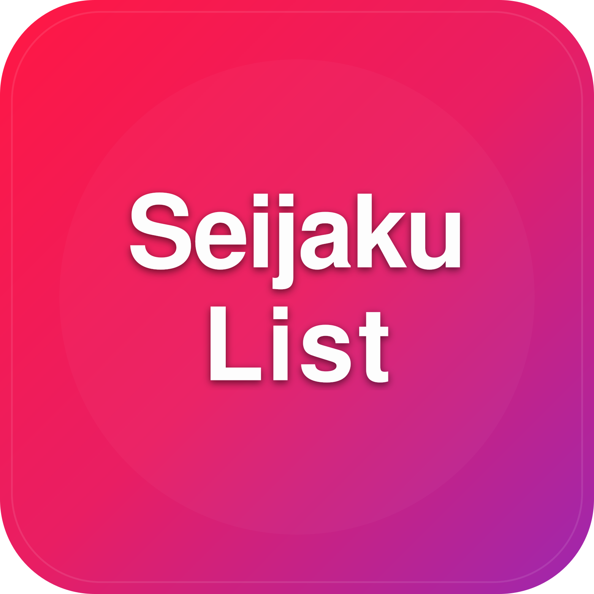

# 📌 SeijakuList

<p align="center">
  
</p>

**SeijakuList** es una aplicación Android desarrollada en **Kotlin con Jetpack Compose**, pensada para que los usuarios gestionen y registren sus animes favoritos de una forma simple y moderna.  

---

## 📖 Descripción  

Con **SeijakuList** podés:  
- 📺 Registrar animes y organizar su estado (Viendo, Completado, Pendiente, etc.).  
- 📝 Marcar episodios vistos y veces vistas.  
- ☁️ Guardar tu progreso en la nube gracias a Firebase.  
- 🔄 Sincronizar automáticamente tu lista entre dispositivos.  
- 🔍 Filtrar y buscar animes fácilmente.
- 📚 Obtener información detallada sobre tus personajes, animes, estudios, etc.
- 🏆 Obtener logros mediante el uso de la aplicación.
- 👤 Personalizar tu perfil.
- 🎨 Entre otras cosas.

---

## 🛠️ Tecnologías usadas  

- **Lenguaje:** Kotlin  
- **UI:** Jetpack Compose  
- **Arquitectura:** MVVM + StateFlow  
- **Persistencia local:** Room (ORM sobre SQLite)  
- **Inyección de dependencias:** Hilt  
- **Navegación:** Navigation Compose  
- **Asincronía:** Kotlin Coroutines + Flow  
- **Red:** Retrofit + Gson (consumo de APIs)  
- **Carga de imágenes:** Coil  
- **Backend:** Firebase (Auth + Firestore + Storage + Crashlytics) partes en desarrollo e integracion


---

## 📸 Vistazo Rápido (Screenshots)

<p align="center">
  
  
  
</p>

<p align="center">
  
  
</p>

---

## 🚀 Instalación y uso  

1. Clonar el repositorio:  
   ```bash
   git clone https://github.com/Pedro-kt/seijaku-list.git

2. Abrir el proyecto en Android Studio.

3. Configurar tu proyecto en Firebase y descargar el google-services.json.

4. Colocar el archivo en la carpeta app/.

5. Selecciona un dispositivo o emulador con API 26 (Android 8.0) o superior y ejecutalo en el mismo


