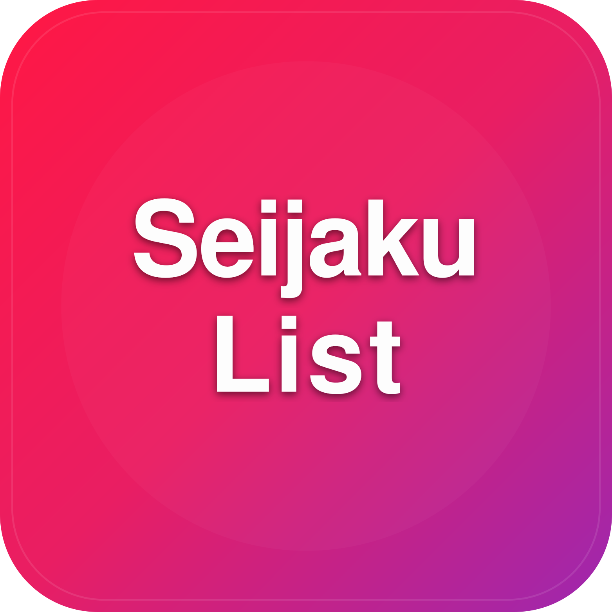

# SeijakuList

<p align="center">
  
</p>

<p align="center">
  
  
  
  
  
</p>

**SeijakuList** es una aplicación Android nativa desarrollada en **Kotlin con Jetpack Compose** para gestionar, descubrir y registrar animes. Permite llevar un seguimiento detallado de tu lista personal, explorar contenido desde la API de [Jikan (MyAnimeList)](https://jikan.moe/), sincronizar todo con la nube mediante Firebase, y compartir tu progreso con una imagen generada al instante.

---

## Indice

- [Pantallas y funcionalidades](#pantallas-y-funcionalidades)
  - [Autenticacion](#autenticacion)
  - [Home](#home)
  - [Busqueda](#busqueda)
  - [Detalle del anime (API)](#detalle-del-anime-api)
  - [Mi lista de animes](#mi-lista-de-animes)
  - [Detalle del anime guardado](#detalle-del-anime-guardado)
  - [Compartir anime (Story Card)](#compartir-anime-story-card)
  - [Perfil de usuario](#perfil-de-usuario)
  - [Sistema de logros](#sistema-de-logros)
  - [Personajes](#personajes)
  - [Configuracion y temas](#configuracion-y-temas)
  - [Novedades y changelog](#novedades-y-changelog)
  - [Extras](#extras)
- [Arquitectura](#arquitectura)
- [Stack tecnologico](#stack-tecnologico)
- [Estructura del proyecto](#estructura-del-proyecto)
- [Base de datos local](#base-de-datos-local)
- [Integracion con la API Jikan](#integracion-con-la-api-jikan)
---

## Pantallas y funcionalidades

### Autenticacion

- Registro con email y contraseña (Firebase Auth) con validacion de campos.
- Login con persistencia de sesion automatica.
- Pantalla de splash que detecta el estado de autenticacion y redirige directamente al Home o a la pantalla de login segun corresponda.
- Confirmacion antes de cerrar sesion (dialogo de advertencia).

---

### Home

La pantalla principal se organiza en **secciones dinamicas** con cache en memoria — los datos persisten mientras la app esta abierta sin re-fetchear al navegar.

#### Mini-stats en Home
Si el usuario tiene animes guardados, se muestra un panel rapido con:
- Total de animes en la lista
- Episodios vistos
- Promedio de puntaje personal
- Acceso directo a "Mis animes"

#### Hero Banner
Card destacada con un anime **aleatorio** (con imagen, titulo, puntaje MAL y boton de detalle) para descubrir contenido nuevo cada vez que abres la app.

#### Secciones de anime (con filtros)

| Seccion | Filtros disponibles |
|---------|-------------------|
| En emision | Dia de la semana (Lun-Dom) |
| Top puntuacion | Tipo (TV, Movie, OVA, ONA, Special) |
| Proxima temporada | Tipo (TV, Movie, OVA, ONA, Special) |

Cada seccion tiene:
- Chips de filtro animados (fade in/out).
- Estados de carga, contenido y vacio con transiciones.
- Boton "Ver mas" que abre una grilla expandida con paginacion.

#### Indicador "en lista"
Todas las cards del Home muestran un **badge** en la esquina superior izquierda si ese anime ya esta en la lista del usuario. El badge muestra el estado actual (Viendo, Completado, Planeado, etc.) con el color correspondiente, sin necesidad de entrar al detalle.

#### Banner "Que hay de nuevo"
Se muestra automaticamente una vez por `versionCode` al abrir la app. Redirige a la pantalla de Novedades con el historial completo de cambios.

---

### Busqueda

- Campo de busqueda con placeholder "Anime, manga, personajes...".
- Filtros por categoria: Anime, Manga, Generos, Personajes, Staff, Estudios.
- Selector de genero con dropdown.
- Resultados paginados con carga progresiva (load more al llegar al final).
- Estados de carga, error (sin internet) y vacio.
- Adaptacion automatica de colores a tema claro/oscuro basada en luminancia.
- Teclado se cierra al tocar fuera del campo de busqueda.

---

### Detalle del anime (API)

Pantalla de detalle de cualquier anime obtenido desde Jikan. Se organiza en **5 tabs**:

#### Tab 1 — Info general
- Titulo, titulos alternativos (ingles / japones)
- Generos como chips
- Sinopsis
- Puntaje MAL con cantidad de votos
- Tipo (TV / Movie / OVA / etc.)
- Duracion por episodio
- Temporada y anio
- Estado de emision
- Rango MAL
- Rating de edad
- Fuente (manga, novela ligera, original, etc.)
- Galeria de imagenes
- Videos: openings, endings y trailers

#### Tab 2 — Personajes y seiyuus
- Lista de personajes con imagen, nombre y rol (Principal / Secundario)
- Actor de voz asociado con idioma

#### Tab 3 — Episodios
- Lista paginada de episodios con titulo y numero
- Detalle expandible por episodio: sinopsis, duracion, fecha de emision
- Boton "Cargar mas" para paginacion

#### Tab 4 — Productores y estudios
- Estudios con nombre e informacion de productor
- Navegacion al detalle del productor

#### Tab 5 — Recomendaciones y foro
- Animes similares sugeridos con imagen y titulo
- Temas del foro de la comunidad MAL (con link a discusion via WebView)

#### Agregar a la lista (desde el detalle API)
Desde esta misma pantalla se puede agregar el anime a la lista personal configurando:
- Estado (Viendo / Completado / Pendiente / Abandonado / Planeado)
- Puntuacion personal (0 a 10, paso 0.5)
- Opinion libre
- Fechas de inicio y fin
- Si el estado es **Planeado**: prioridad (Alta / Media / Baja) y nota del plan

Si el anime ya esta en la lista, los campos se pre-rellenan con los datos existentes. Al cambiar de "Planeado" a otro estado se muestra un dialogo de advertencia indicando que la prioridad y nota se eliminaran.

---

### Mi lista de animes

Vista completa de la coleccion personal con multiples modos de visualizacion y opciones de organizacion.

#### Modos de visualizacion

| Modo | Descripcion |
|------|-------------|
| Grilla | 3 columnas compactas con portada y score |
| Lista | Tarjetas horizontales con portada, titulo, progreso, estado y boton +1 |
| Tarjetas | 2 columnas con cards estilo "onboarding" con gradiente y badge de tipo |

#### Filtros y busqueda
- Filtro por estado: Viendo / Completado / Pendiente / Abandonado / Planeado
- Busqueda por titulo
- Ordenamiento: A-Z / Z-A / sin orden

#### Chip de estado moderno
Cada anime muestra un chip con:
- Punto de color del estado
- Nombre del estado en texto blanco (PoppinsBold)
- Icono chevron que indica que es interactivo (dropdown)

Al tocar el chip se abre un dropdown con:
- Header "Cambiar estado"
- Cada opcion con su icono y color especifico
- Fondo coloreado en la opcion actualmente seleccionada
- Checkmark en la opcion actual
- Validaciones automaticas:
  - Pasar a **Planeado** con episodios vistos → dialogo de confirmacion para resetear progreso
  - Pasar a **Completado** → dialogo con resumen de episodios y confirmacion
  - Pasar de otro estado a **Completado** con todos los episodios vistos → opcion de confirmar
  - Cambiar desde **Planeado** a otro estado con datos de plan → advertencia de perdida de prioridad/nota

#### Badge de prioridad
En los modos Lista y Tarjeta, si el anime esta en estado Planeado y tiene prioridad asignada, se muestra un badge junto al chip de estado con el nivel y un punto de color:
- Alta (rojo)
- Media (amarillo)
- Baja (verde)

#### Barra de progreso
En la vista Lista, cada anime "Viendo" muestra una barra de progreso visual con gradiente basada en `episodiosVistos / totalEpisodios`.

#### Boton +1
Atajo visible en la vista Lista para animes "Viendo" con episodios disponibles. Suma un episodio visto directamente sin entrar al detalle.

---

### Detalle del anime guardado

Pantalla de detalle completo del anime en la lista personal. Permite ver y editar toda la informacion de seguimiento.

#### Secciones

**Header**
- Imagen de fondo con desenfoque y gradiente
- Portada flotante con sombra y borde blanco
- Titulo, puntuacion personal con estrellas y chip de estado

**Botones de accion**
- "Puntuar" — abre el editor de puntuacion y opinion
- "Editar" — abre formulario completo de edicion

**Estadisticas rapidas**
- Episodios vistos (con icono de TV)
- Veces visto / rewatch count (con icono de renovacion)

**Prioridad del plan** (solo si estado == Planeado)
- Chip con nivel de prioridad (Alta / Media / Baja) y color correspondiente
- Nota del plan en texto
- Boton de edicion que abre dialogo con chips de prioridad + campo de texto

**Generos** — chips en FlowRow

**Sinopsis** — texto completo con tipografia legible

**Otros titulos** — titulo en ingles y japones (si estan disponibles)

**Estudios** — chips en FlowRow

**Informacion completa**
Tabla con todos los datos del anime guardados localmente:
- Puntaje MAL y cantidad de votos
- Tipo, duracion, temporada, anio
- Estado de emision, fechas de emision
- Ranking MAL, rating de edad, fuente/origen

**Fechas de seguimiento**
- Fecha de inicio: selector de fecha con calendario + boton de borrar
- Fecha de fin: idem
- Formato de visualizacion: dd/MM/yyyy

**Opinion personal** — resena del usuario con boton de edicion

---

### Compartir anime (Story Card)

Desde el detalle del anime guardado, el boton de compartir genera y comparte una **imagen tipo story** personalizada con los datos del usuario.

#### Proceso de generacion
1. Descarga la imagen del anime con Coil en hilo de IO.
2. Genera un canvas de **1600 x 3200 px** con todos los elementos graficos.
3. Guarda el resultado como PNG de maxima calidad (100%) en el directorio de cache.
4. Abre el selector de apps del sistema para compartir (`Intent.ACTION_SEND`).

#### Diseno de la Story Card
La imagen generada incluye, de arriba hacia abajo:

| Elemento | Descripcion |
|----------|-------------|
| Barra de acento | Linea azul (`#58A6FF`) en la parte superior |
| Fondo | Imagen del anime escalada con overlay gradiente negro |
| Portada | Poster del anime centrado (780x1060px), con bordes redondeados, sombra y borde blanco |
| Titulo | Titulo en blanco (hasta 2 lineas), titulo japones en gris italico debajo |
| Puntuacion | Score personal del usuario en azul grande + "MI PUNTUACION", puntaje MAL en gris |
| Divisor | Linea blanca sutil |
| Grilla de stats | 6 celdas: episodios vistos, estado, tipo, temporada, rewatch count, rank MAL |
| Generos | Texto de generos centrado en gris |
| Branding | "SEIJAKU LIST" en blanco + tagline "Tu lista de anime personal" en azul |

Mientras se genera, el boton muestra un spinner y queda deshabilitado. Al terminar, el sistema abre el chooser para compartir por WhatsApp, Instagram, Twitter, etc.

---

### Perfil de usuario

#### Setup inicial
Al registrarse, el usuario configura su perfil:
- Seleccion de foto de perfil (imagen del dispositivo, sube a Firebase Storage)
- Nombre de usuario (obligatorio)
- Bio personal (opcional, maximo 150 caracteres con contador)
- Los campos se pre-rellenan al editar el perfil existente

#### Vista del perfil
El perfil se organiza en secciones con scroll:

**Header**
- Avatar circular con animacion de escala al cargar
- Nombre de usuario
- Bio
- Boton de edicion

**Estadisticas (grilla de 6 tarjetas)**

| Estadistica | Descripcion |
|-------------|-------------|
| Total animes | Cantidad total en la lista |
| Completados | Animes con estado Completado |
| Episodios vistos | Suma de todos los episodios vistos |
| Mangas | Placeholder (en desarrollo) |
| Genero favorito | El genero que mas se repite en la lista |
| Puntaje promedio | Media de todos los scores personales |

**Logros** — barra de progreso + badges. Ver [Sistema de logros](#sistema-de-logros).

**Generos favoritos (top 3)**
Cards con gradiente mostrando:
- Nombre del genero
- Cantidad de animes de ese genero
- Porcentaje sobre el total

**Top 5 animes**
Scroll horizontal de 5 tarjetas con:
- Insignia de posicion: oro (#1), plata (#2), bronce (#3), indigo (#4), rosa (#5)
- Efecto shimmer en las posiciones 1-3
- Portada del anime
- Titulo y puntuacion personal
- Boton de edicion para cambiar el top 5

#### Tab Anime / Manga
Selector animado para alternar entre la vista de anime y la de manga (manga en desarrollo).

#### Sincronizacion
El perfil se guarda en Firestore y se sincroniza automaticamente entre dispositivos con la misma cuenta.

---

### Sistema de logros

Los logros se muestran en el perfil con insignias, barra de progreso y rareza.

#### Rareza de logros

| Rareza | Emoji | Color |
|--------|-------|-------|
| Normal | Trofeo | Verde |
| Rare | Diamante | Azul |
| Epic | Estrella | Purpura |
| Legendary | Corona | Naranja |

#### Logros disponibles (10 de 20 totales)

| Logro | Condicion | Rareza |
|-------|-----------|--------|
| Pionero | Unirse en el primer mes de SeijakuList | Legendary |
| Analista | Escribir la primera resena | Normal |
| Critico | Escribir 10 resenas | Rare |
| Veterano | Llevar 1 anio en SeijakuList | Epic |
| Coleccionista Principiante | Agregar 10 animes a la lista | Normal |
| Maratonista | Marcar 50 episodios vistos en una semana | Epic |
| Coleccionista Avanzado | Agregar 50 animes a la lista | Rare |
| Coleccionista Experto | Agregar 100 animes a la lista | Legendary |
| Maratonista Avanzado | Marcar 100 episodios vistos en una semana | Legendary |
| Coleccionista Master | Agregar 200 animes a la lista | Legendary |

Desde el perfil se puede abrir un dialogo con todos los logros y un segundo dialogo de detalle con fecha de desbloqueo y recompensa de insignia.

---

### Personajes

- Detalle completo de personaje: nombre, imagen, descripcion, rol.
- Galeria de imagenes del personaje con scroll horizontal.
- Actor de voz asociado.
- Accesible desde el tab de personajes en el detalle del anime.

---

### Configuracion y temas

#### Temas disponibles

| Tema | Descripcion |
|------|-------------|
| Sistema | Sigue la configuracion del dispositivo (claro/oscuro) |
| Claro | Tema claro forzado |
| Oscuro | Tema oscuro forzado (por defecto) |
| Japones | Tema especial con paleta de colores diferenciada |

El tema se aplica instantaneamente al seleccionarlo sin reiniciar la app. El estado se mantiene via `SettingsViewModel` con scope `@Singleton`.

#### Seccion de cuenta
- Visualizacion del email de la cuenta activa
- Boton de cerrar sesion con dialogo de confirmacion

#### Seccion informacion
- Version de la app (obtenida dinamicamente del `PackageManager`)
- Link a la Politica de privacidad
- Link al sitio de YumeDev
- Link a Reportar error

---

### Novedades y changelog

Historial de versiones con secciones colapsables.

- La ultima version comienza expandida.
- Cada version muestra el numero de cambios cuando esta colapsada.
- Al expandir, se listan las entradas con tipo, titulo y descripcion.
- Tres tipos de cambio con colores e iconos distintos:

| Tipo | Color | Icono |
|------|-------|-------|
| NUEVO | Azul | Sparkle |
| MEJORA | Terciario | Trending Up |
| CORRECCION | Rojo | Bug Report |

---

### Extras

- **Ver mas**: grilla expandida para cada seccion del Home (En emision, Top, Proxima temporada) con filtros y paginacion completa usando `CardAnimesHomeGrid`.
- **Reporte de errores**: formulario para enviar bugs o sugerencias directamente desde la app.
- **Politica de privacidad**: pantalla con las 13 secciones de la politica, incluyendo datos recopilados, uso, almacenamiento, derechos del usuario (acceso, correccion, eliminacion, exportacion) y contacto `seijakulist@gmail.com`.
- **WebView integrado**: abre links externos dentro de la app con barra de navegacion.
- **Mangas** (en desarrollo): seccion de mis mangas accesible desde el menu, pendiente de implementacion completa.

---

## Arquitectura

```
Presentation (Jetpack Compose)
    └── Composables observan StateFlow via collectAsState()

ViewModel (MVVM)
    └── Expone StateFlow, gestiona logica de UI y ciclo de vida

Domain Layer
    ├── Use Cases (GetAnimeDetailUseCase, etc.)
    └── Domain Models (Anime, AnimeDetail, AnimeEntityDomain, etc.)

Data Layer
    ├── AnimeRepository          → Jikan API (Retrofit)
    ├── AnimeLocalRepository     → Room SQLite
    └── FirestoreAnimeRepository → Firebase Firestore + Storage
```

### Patrones clave

- **StateFlow** para todo el estado reactivo. Sin LiveData.
- **Singleton cache** en los ViewModels del Home: las listas de anime persisten en memoria durante la sesion, evitando re-fetching al navegar hacia atras.
- **Mappers explicitos** entre capas: `AnimeEntity` ↔ `AnimeEntityDomain` ↔ `AnimeDetail`.
- **Room Migrations** para evolucionar el esquema sin perder datos de usuarios existentes (v6 → v13).
- **FileProvider** para compartir imagenes generadas con apps externas de forma segura.
- **Coroutines + Dispatchers** bien gestionados: IO para red/disco, Main para UI.

---

## Stack tecnologico

| Capa | Tecnologia |
|------|-----------|
| Lenguaje | Kotlin 2.0 |
| UI | Jetpack Compose + Material 3 |
| Arquitectura | MVVM + Clean Architecture |
| Inyeccion de dependencias | Hilt (Dagger) |
| Navegacion | Navigation Compose |
| Persistencia local | Room (SQLite) v13 |
| Red | Retrofit + Gson |
| Imagenes | Coil |
| Animaciones | Lottie + Compose Animations |
| Generacion de imagenes | Android Canvas API (Bitmap) |
| Compartir archivos | FileProvider + Intent.ACTION_SEND |
| Autenticacion | Firebase Auth |
| Base de datos en la nube | Firebase Firestore |
| Almacenamiento de archivos | Firebase Storage |
| Asincronía | Kotlin Coroutines + Flow |
| API externa | Jikan REST API v4 (MyAnimeList) |
| SDK minimo | API 26 (Android 8.0) |
| SDK objetivo | API 35 (Android 15) |

---

## Estructura del proyecto

```
com.yumedev.seijakulist/
├── data/
│   ├── local/
│   │   ├── dao/            AnimeDao, UserProfileDao
│   │   ├── entities/       AnimeEntity, UserProfile
│   │   ├── migration/      MIGRATION_6_7 ... MIGRATION_12_13
│   │   └── database/       AnimeDatabase (v13)
│   ├── mapper/local/       AnimeEntityMapper
│   ├── remote/
│   │   ├── api/            JikanApiService
│   │   └── models/         DTOs (anime, characters, episodes, videos, themes, forum, recommendations)
│   └── repository/
│       ├── AnimeRepository
│       ├── AnimeLocalRepository
│       └── FirestoreAnimeRepository
├── domain/
│   ├── models/             Anime, AnimeDetail, AnimeCard, AnimeEntityDomain,
│   │                       AnimeEpisode, AnimeVideos, AnimePicture, AnimeThemes,
│   │                       AnimeRecommendation, ForumTopic, CharacterDetail, Genre, ...
│   └── usecase/            GetAnimeDetailUseCase, ...
├── ui/
│   ├── components/         CardAnimesHome, CardAnimesHomeGrid, AnimeStatusChip,
│   │                       CustomDialog, AppScaffold, loaders, dialogs, ...
│   ├── navigation/         AppDestinations, NavGraph
│   ├── screens/
│   │   ├── auth_screen/    AuthScreen, LoginScreen, RegisterScreen, AuthViewModel
│   │   ├── home/           HomeScreen, AnimeSeasonNowViewModel, TopAnimeViewModel,
│   │   │                   AnimeSeasonUpcomingViewModel, AnimeRandomViewModel,
│   │   │                   AnimeScheduleViewModel, LocalAnimeIdsViewModel, ...
│   │   ├── detail/         AnimeDetailScreen, AnimeDetailViewModel
│   │   ├── local_anime_detail/ LocalAnimeDetailScreen, LocalAnimeDetailViewModel
│   │   ├── my_animes/      MyAnimesScreen, MyAnimesViewModel
│   │   ├── profile/        ProfileView, ProfileSetupView, SelectTop5Screen, ProfileViewModel
│   │   ├── search/         SearchScreen, SearchViewModel, GenresViewModel
│   │   ├── viewmore/       ViewMoreScreen, ViewMoreViewModel
│   │   ├── configuration/  ConfigurationScreen, SettingsViewModel
│   │   ├── novedades/      NovedadesScreen
│   │   ├── characters/     CharacterDetailScreen
│   │   ├── report/         ReportErrorScreen
│   │   └── policy_privacy/ PolicyPrivacyScreen
│   └── theme/              Color, Typography (Poppins), Shape, Theme
└── util/                   UserAction
```

---

## Base de datos local

**Room Database v13** — tabla `animes`:

```
-- Identificacion
malId           INT PRIMARY KEY    (ID de MyAnimeList)
title           TEXT
imageUrl        TEXT

-- Seguimiento del usuario
userScore       REAL               Puntuacion personal (0-10)
statusUser      TEXT               Viendo | Completado | Pendiente | Abandonado | Planeado
userOpiniun     TEXT               Resena personal
episodesWatched INT
totalEpisodes   INT
rewatchCount    INT
startDate       INTEGER            Timestamp en milisegundos
endDate         INTEGER            Timestamp en milisegundos

-- Datos del anime (guardados offline)
synopsis        TEXT
titleEnglish    TEXT
titleJapanese   TEXT
genres          TEXT               Separados por coma
studios         TEXT               Separados por coma
score           REAL               Puntaje MAL
scoreBy         INT                Cantidad de votos MAL
typeAnime       TEXT               TV | Movie | OVA | ONA | Special
duration        TEXT
season          TEXT
year            TEXT
status          TEXT
aired           TEXT
rank            INT
rating          TEXT               PG-13 | R | R+ | Rx
source          TEXT

-- Planificacion (solo relevante si statusUser = 'Planeado')
plannedPriority TEXT               Alta | Media | Baja
plannedNote     TEXT               Nota o motivo del plan
```

---

## Integracion con la API Jikan

Consume la **Jikan REST API v4** — wrapper no oficial y gratuito de MyAnimeList. No requiere API key.

### Endpoints utilizados

| Categoria | Endpoint |
|-----------|----------|
| Temporada actual | `GET /seasons/now` |
| Top anime | `GET /top/anime` |
| Proxima temporada | `GET /seasons/upcoming` |
| Horario de emision | `GET /schedules` |
| Busqueda | `GET /anime?q={query}` |
| Filtro por tipo | `GET /top/anime?type={type}` |
| Detalle | `GET /anime/{id}` |
| Personajes | `GET /anime/{id}/characters` |
| Imagenes | `GET /anime/{id}/pictures` |
| Videos | `GET /anime/{id}/videos` |
| Temas musicales | `GET /anime/{id}/themes` |
| Episodios | `GET /anime/{id}/episodes?page={n}` |
| Detalle de episodio | `GET /anime/{id}/episodes/{ep}` |
| Recomendaciones | `GET /anime/{id}/recommendations` |
| Foro | `GET /anime/{id}/forum` |
| Detalle de personaje | `GET /characters/{id}` |
| Imagenes de personaje | `GET /characters/{id}/pictures` |
| Detalle de productor | `GET /producers/{id}` |
| Generos | `GET /genres/anime` |
| Anime aleatorio | `GET /random/anime` |
| Personaje aleatorio | `GET /random/characters` |

---

## Capturas de pantalla

<p align="center">
  
  
  
</p>

<p align="center">
  
  
</p>

---

<p align="center">
  Desarrollado por <strong>Pedro Bustamante</strong> &nbsp;·&nbsp;
  <a href="https://github.com/Pedro-kt/seijaku-list">GitHub</a>
</p>