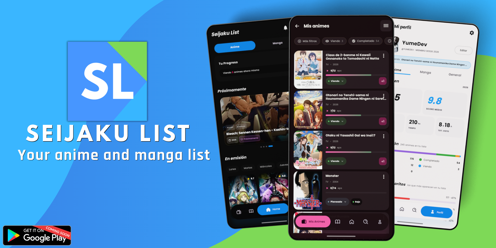

> [!WARNING]
> **Seijaku List is currently migrating from Jikan API to AniList.**
>
> The migration is required because the public Jikan API will be discontinued in October 2026.
>
> During this transition period, some features may be temporarily affected while providers and integrations are being updated.

  

  
  
  
  
  

Your ultimate companion for organizing, discovering, and sharing your passion for anime. Seijaku List is a native Android application that allows you to keep track of your favorite anime, discover new titles, sync everything to the cloud, and much more.

---

## ✨ Main Features

### 🏠 Smart Discovery

- **Hero Banner** featuring a random anime every time you open the app
- Dynamic sections: Currently Airing, Top Rated, Upcoming Season
- Filters by type (TV, Movie, OVA) and day of the week
- Collection mini-stats directly on the Home screen

### 🔍 Advanced Search

- Search for anime, manga, characters, studios, and more
- Genre filters with over 40 categories
- Paginated results with progressive loading
- Full integration with the MyAnimeList API through Jikan

### 📝 Anime List Management

- **3 display modes**: Grid, List, and Cards
- Custom statuses: Watching, Completed, Planned, On Hold, Dropped
- Priority system for planned anime (High / Medium / Low)
- Episode tracking with progress bars
- +1 button for quickly marking watched episodes
- Custom start and finish dates

### 🎯 Detailed Information

- 5 information tabs: Overview, Characters, Episodes, Producers, Recommendations
- Image and video gallery (trailers, openings, endings)
- Episode list with individual synopses
- Character information with voice actors
- Community discussion integration

### ⭐ Ratings and Reviews

- Rate anime from 0 to 10 (0.5 increments)
- Write personal reviews and notes
- Track rewatch counts
- Compare your score with the MyAnimeList average

### 📊 Profile and Statistics

- Statistics dashboard with total anime, completed titles, and watched episodes
- Automatically detected favorite genre
- Customizable Top 5 anime showcase
- Personalized avatar and biography
- Automatic Firebase synchronization

### 🏆 Achievement System

- 10 unlockable achievements (more coming soon)
- 4 rarity levels: Normal, Rare, Epic, Legendary
- Special badges: Pioneer, Marathoner, Collector, and more

### 🎨 Social Sharing

- Generate personalized **Story Cards** instantly
- Optimized for Instagram, WhatsApp, Twitter/X, and other platforms
- Elegant design featuring your anime data and ratings
- Share your progress with a single tap

### 🎨 Themes and Customization

- 4 available themes: System, Light, Dark, Japanese
- Material 3 with dynamic color support
- Smooth and fluid animations
- Offline mode with synchronized data

### 🔔 Updates and Changelog

- Built-in changelog
- New version notifications
- Complete update history

---

## 🛠 Tech Stack

**Seijaku List** is built with modern Android technologies:

- **Language**: Kotlin 2.0
- **UI**: Jetpack Compose + Material 3
- **Architecture**: MVVM + Clean Architecture
- **Local Database**: Room (SQLite)
- **Backend**: Firebase (Auth, Firestore, Storage)
- **API**: Jikan v4 (MyAnimeList) / AniList (Migration in Progress)
- **Navigation**: Navigation Compose with Shared Element Transitions
- **Images**: Coil with optimized caching
- **Animations**: Lottie + Compose Animations

[📖 View Full Technical Documentation →](README_TECHNICAL.md)

---

## 📄 License

This project is open source. See the [LICENSE](LICENSE) file for more information.

---

  Made with ❤️ by <strong>Pedro Bustamante</strong>

